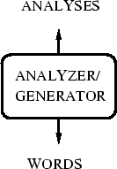

#### Introduction

A word can be simple or complex. For example, the word 'cat' is simple because one cannot further decompose the word into smaller part. On the other hand, the word 'cats' is complex, because the word is made up of two parts: root 'cat' and plural suffix '-s'

#### Objective

The objective of the experiment is to learn about morphological features of a word by analysing it.
